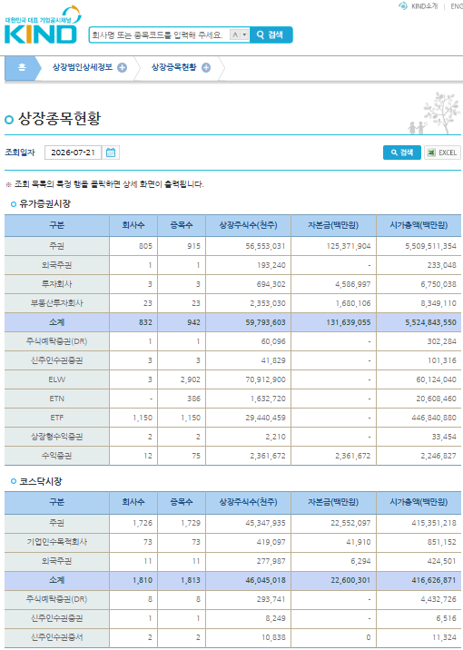

# 상장종목현황 (`listed_issue_status`)

KIND **상장종목현황** 화면(`corpgeneral/listedissuestatusdetail.do`)의 requests 엔드포인트.
특정일 기준으로 **시장·증권구분별 상장종목 목록**을 엑셀(.xls)로 내려받는다. 이
엔드포인트로 **주권 보통주**와 **외국주권**의 *현재 목록*을 받아올 수 있다.



> ⚠️ 위 스크린샷 파일은 저장소에 아직 없다. `docs/assets/listed-issue-status.png` 로
> 넣으면 이 이미지가 렌더링된다. (아래 표에 같은 내용을 텍스트로 옮겨두었다.)

## 무엇을 받아오나

- 응답은 `application/vnd.ms-excel`(.xls)이지만 실제로는 **EUC-KR HTML 표**라
  `pd.read_html`로 파싱된다(내부적으로 `corp_list` 파서 재사용 — 종목코드 6자리 정규화).
- 반환 컬럼: `구분 · 시장구분 · 회사명 · 종목코드 · 상장일 · 상장주식수(천주)`
- **목록은 회사 단위(보통주 기준)**다. 화면의 *회사수*와 행 수가 일치하고, *종목수*
  (우선주 등 포함)와는 다르다. 예: 유가 주권 회사수 805 = 다운로드 805행, 종목수 915.
  → 즉 `secugrpId=ST` 목록 = **주권 보통주(회사별 대표종목)** 현재 목록.

## 사용법

```python
from krx_kind_data_api import fetch

# 주권 보통주 현재 목록 (유가)
st = fetch("listed_issue_status", mktId="STK", secugrpId="ST")
len(st)                       # 종목수(=회사수) = 805

# 외국주권 현재 목록 (유가)
fs = fetch("listed_issue_status", mktId="STK", secugrpId="FS")   # 1

# 코스닥
fetch("listed_issue_status", mktId="KSQ", secugrpId="ST")        # 주권 1,726
fetch("listed_issue_status", mktId="KSQ", secugrpId="FS")        # 외국주권 11
```

### 파라미터

| 이름 | 값 | 설명 |
|------|----|------|
| `mktId` | `STK`(유가) / `KSQ`(코스닥) / `KNX`(코넥스) | 시장. 기본 `STK` |
| `secugrpId` | `ST`(주권) / `FS`(외국주권) / `EF`(ETF) / `EN`(ETN) … | 증권 구분. 기본 `ST` |
| `selDate` | `YYYYMMDD` 또는 `YYYY-MM-DD` | 조회 기준일. 대시 있어도 자동 정규화, 생략 시 오늘 |

## 시장·증권구분별 종목수 (2026-07-21 기준, 화면 캡처 전사)

### 유가증권시장

| 구분 | 회사수 | 종목수 | 상장주식수(천주) | 자본금(백만원) | 시가총액(백만원) |
|------|------:|------:|----------------:|--------------:|----------------:|
| 주권 | 805 | 915 | 56,553,031 | 125,371,904 | 5,509,511,354 |
| 외국주권 | 1 | 1 | 193,240 | - | 233,048 |
| 투자회사 | 3 | 3 | 694,302 | 4,586,997 | 6,750,038 |
| 부동산투자회사 | 23 | 23 | 2,353,030 | 1,680,106 | 8,349,110 |
| **소계** | **832** | **942** | **59,793,603** | **131,639,055** | **5,524,843,550** |
| 주식예탁증권(DR) | 1 | 1 | 60,096 | - | 302,284 |
| 신주인수권증권 | 3 | 3 | 41,829 | - | 101,316 |
| ELW | 3 | 2,902 | 70,912,900 | - | 60,124,040 |
| ETN | - | 386 | 1,632,720 | - | 20,608,460 |
| ETF | 1,150 | 1,150 | 29,440,459 | - | 446,840,880 |
| 상장형수익증권 | 2 | 2 | 2,210 | - | 33,454 |
| 수익증권 | 12 | 75 | 2,361,672 | 2,361,672 | 2,246,827 |

### 코스닥시장

| 구분 | 회사수 | 종목수 | 상장주식수(천주) | 자본금(백만원) | 시가총액(백만원) |
|------|------:|------:|----------------:|--------------:|----------------:|
| 주권 | 1,726 | 1,729 | 45,347,935 | 22,552,097 | 415,351,218 |
| 기업인수목적회사 | 73 | 73 | 419,097 | 41,910 | 851,152 |
| 외국주권 | 11 | 11 | 277,987 | 6,294 | 424,501 |
| **소계** | **1,810** | **1,813** | **46,045,018** | **22,600,301** | **416,626,871** |

> 위 집계 표(회사수/종목수/자본금/시가총액)는 화면 상단 요약이며, 엔드포인트가
> 내려주는 것은 각 (시장, 증권구분)의 **개별 종목 목록**이다. 종목수는 목록 행 수로 얻는다.
